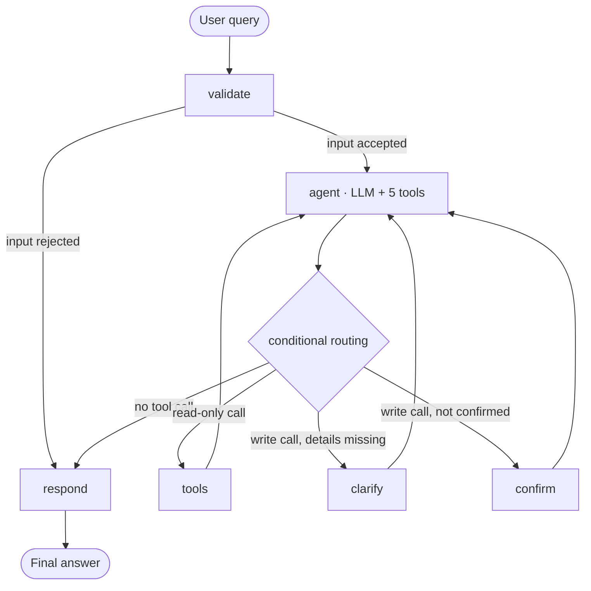

# AI IT Support Assistant

An agentic AI help desk assistant for a fictional organisation (Sourcify), built
with **LangGraph** for workflow orchestration and **Streamlit** for the chat
interface. It answers IT questions from a local knowledge base, looks up existing
support tickets, and raises new ones — but only after it has the details it needs
and the employee has agreed.

---

## Problem statement

IT service desks spend most of their time on a small set of repetitive requests:
"how do I reset my VPN password", "what is happening with my laptop ticket", and
"please raise a ticket for X". Each one requires someone to read a knowledge base
article, query a ticket system, or fill in a ticket form on the employee's behalf.

The requests are repetitive, but they are not scripted: the same intent arrives in
different words, the employee often leaves out the details needed to act, and some
requests must never be executed blindly. A ticket raised without an employee ID is
useless; a second ticket for a problem already being worked is worse than useless.

## Solution overview

The assistant is an LLM agent that decides, per turn, whether a tool is needed and
which one. Around that decision sits a LangGraph workflow that enforces the rules
the model cannot be trusted to enforce on its own:

- **Reads run freely.** Knowledge search, ticket lookup, employee lookup and
  system status execute as soon as the model asks for them.
- **The one write is gated.** `create_ticket` is intercepted. If required details
  are missing the graph routes to a `clarify` node; if the employee has not
  confirmed, it routes to a `confirm` node. Neither writes anything.
- **State is remembered, and scoped.** An employee ID given in one turn is still
  known three turns later, so "yes, check my tickets" resolves without asking
  again. When a different ID appears, the remembered profile and any pending
  draft are dropped rather than re-attributed, and a "yes" that also names a new
  employee does not stand as confirmation for the previous one's ticket.
- **Everything is auditable.** Each tool call and its raw result is recorded and
  shown in the UI, so a reader can see which facts came from the local systems
  and which text is the model's own recommendation.

### The interface

The app is a three-column workspace: a session sidebar on the left, the
conversation in the middle, and the local data docked as a sidebar on the right.

**Left — the session.** The active model and thread, a Clear conversation button,
four sample prompts, and the five tools the assistant can reach.

**Middle — the conversation.** An identity banner at the top shows who the
assistant currently believes it is helping: initials, name, department, location,
and VPN/MFA state, with the employee ID highlighted as a badge. It reads
"No employee identified yet" until an ID is captured. Employee and ticket
references (`EMP1024`, `INC-10001`) are highlighted inline wherever they appear
in an answer. Tickets touched during a turn are rendered as cards with coloured
status and priority chips, followed by an expandable trace of every tool call
and its raw JSON result.

**Right — the local data**, docked as a full-height sidebar with three tabs, so an
evaluator can read the same sources the assistant works from and check its
answers:

| Tab                   | Contents                                                                                                                                                             |
| --------------------- | -------------------------------------------------------------------------------------------------------------------------------------------------------------------- |
| 📚 Knowledge base     | All 15 articles with a live BM25 filter, full text, tags, relevance score, and an "Ask the assistant about this" button that sends the article's title into the chat |
| 🎫 Tickets            | Status counters plus the full ticket table, filterable by status and category                                                                                        |
| 👥 Directory & status | The 12-employee directory and the current health of all six services                                                                                                 |

### Example: the multi-turn flow from the brief

```
User:      I have a VPN issue.
Assistant: [system_status] There is a known degradation on the EMEA VPN gateway.
           What is your employee ID?
User:      EMP1024.
Assistant: [get_employee] Found your profile, Priya Sharma (Finance, Bengaluru).
           Would you like me to check your existing tickets?
User:      Yes.
Assistant: [ticket_lookup] You have INC-10001 (In Progress) for VPN drops.
```

---

## Architecture



`docs/architecture.md` has the full node table, the state channels and their
reducers, and the safety controls.

### Tools

| Tool               | Purpose                                              | Backing data    |
| ------------------ | ---------------------------------------------------- | --------------- |
| `knowledge_search` | BM25 search over IT how-to articles                  | `kb_articles`   |
| `ticket_lookup`    | Search tickets by employee, ID, status or keyword    | `tickets`       |
| `create_ticket`    | Raise a ticket — validated, confirmed, de-duplicated | `tickets`       |
| `get_employee`     | Resolve an employee from an ID, email or name        | `employees`     |
| `system_status`    | Current health of internal services                  | `system_status` |

---

## Technology stack

| Layer         | Choice                                                                   |
| ------------- | ------------------------------------------------------------------------ |
| Orchestration | LangGraph (`StateGraph`, conditional edges, `SqliteSaver` checkpoints)   |
| LLM           | Ollama (`qwen3.5:4b-mlx`) by default; Anthropic Claude as an alternative |
| Tool calling  | `langchain-core` tools with native function calling                      |
| Storage       | SQLite, seeded from JSON sample data                                     |
| Retrieval     | BM25 keyword ranking implemented in pure Python                          |
| UI            | Streamlit chat                                                           |
| Config        | pydantic-settings, `.env`                                                |
| Tests         | pytest (65 tests, no network required)                                   |

---

## Project structure

```
new-it-support/
├── app.py                      Streamlit chat interface
├── .streamlit/config.toml      Pinned theme for the interface palette
├── src/it_support/
│   ├── config.py               Settings loaded from .env
│   ├── db.py                   SQLite schema, seeding, connections
│   ├── graph.py                LangGraph nodes, routing, compilation
│   ├── llm.py                  Ollama / Anthropic chat-model factory
│   ├── prompts.py              System prompt and gate instructions
│   ├── search.py               BM25 index
│   ├── browse.py               Read-only queries for the reference panels
│   ├── ui_theme.py             Stylesheet and status chips
│   ├── state.py                AgentState definition
│   └── tools/
│       ├── base.py             Result envelope, failure wrapper
│       ├── knowledge.py        knowledge_search
│       ├── tickets.py          ticket_lookup, create_ticket
│       ├── employee.py         get_employee
│       └── status.py           system_status
├── data/seed/                  Sample employees, tickets, articles, services
├── scripts/seed_db.py          Build or rebuild the database
├── tests/                      pytest suite
├── docs/architecture.md        Diagrams, node table, safety controls
├── .env.example                Every configurable value
└── requirements.txt
```

---

## Setup

### 1. Requirements

- Python 3.11–3.13
- [Ollama](https://ollama.com) running locally (default provider), **or** an
  Anthropic API key

### 2. Install

```bash
python3 -m venv .venv
source .venv/bin/activate          # Windows: .venv\Scripts\activate
pip install -r requirements.txt
```

### 3. Configure

```bash
cp .env.example .env
```

The defaults work as-is for Ollama. Pull the model once:

```bash
ollama pull qwen3.5:4b-mlx
```

To use Claude instead, set in `.env`:

```
LLM_PROVIDER=anthropic
ANTHROPIC_API_KEY=sk-ant-...
```

### 4. Seed the sample data

```bash
python scripts/seed_db.py          # add --force to rebuild from scratch
```

### 5. Run

```bash
streamlit run app.py
```

The app opens at <http://localhost:8501>. `python -m pytest` runs the test suite;
it uses a temporary database and a scripted stand-in for the model, so it needs
neither Ollama nor an API key.

---

## Environment variables

| Variable                       | Default                  | Purpose                                    |
| ------------------------------ | ------------------------ | ------------------------------------------ |
| `LLM_PROVIDER`                 | `ollama`                 | `ollama` or `anthropic`                    |
| `OLLAMA_BASE_URL`              | `http://localhost:11434` | Ollama server                              |
| `OLLAMA_MODEL`                 | `qwen3.5:4b-mlx`         | Local model (must support tool calling)    |
| `ANTHROPIC_API_KEY`            | _(empty)_                | Required only for `LLM_PROVIDER=anthropic` |
| `ANTHROPIC_MODEL`              | `claude-opus-5`          | Claude model ID                            |
| `LLM_TEMPERATURE`              | `0.0`                    | Determinism for routing decisions          |
| `LLM_MAX_TOKENS`               | `1024`                   | Response cap                               |
| `LLM_TIMEOUT_SECONDS`          | `120`                    | Request timeout                            |
| `DB_PATH`                      | `data/it_support.db`     | Application database                       |
| `SEED_DIR`                     | `data/seed`              | Sample data location                       |
| `CHECKPOINT_DB_PATH`           | `data/checkpoints.db`    | LangGraph conversation state               |
| `KB_SEARCH_TOP_K`              | `3`                      | Articles returned per search               |
| `DUPLICATE_TICKET_WINDOW_DAYS` | `7`                      | Duplicate-detection window                 |
| `MAX_AGENT_STEPS`              | `6`                      | Tool calls allowed per turn                |
| `LOG_LEVEL`                    | `INFO`                   | Logging verbosity                          |

`.env` is git-ignored. No key is ever committed.

---

## Sample data

| File                            | Contents                                                                         |
| ------------------------------- | -------------------------------------------------------------------------------- |
| `data/seed/employees.json`      | 12 employees across 8 departments and 9 locations                                |
| `data/seed/tickets.json`        | 18 tickets spanning Open, In Progress, Resolved, Closed                          |
| `data/seed/knowledge_base.json` | 15 articles: VPN, password, email, hardware, printing, access, security, network |
| `data/seed/system_status.json`  | 6 services, including one degraded and one outage                                |

Useful IDs for a demonstration: `EMP1024` (two VPN tickets, one open),
`EMP1115` (open laptop hardware ticket), `EMP1067` (no VPN entitlement).

---

## Sample inputs and outputs

### 1. Knowledge search

**Input:** `How do I reset my VPN password?`

**Tool:** `knowledge_search` → `KB-001` (relevance 7.78)

**Output:**

> Open the self-service portal at portal.sourcify.example/vpn and sign in with
> your corporate account. Choose **Reset VPN Credentials**, complete the MFA
> challenge, and set a new password of at least 14 characters. It takes effect
> within two minutes.
>
> If you cannot sign in to the portal at all, your account may be locked — raise
> a ticket so the Identity Team can unlock it.

### 2. Ticket lookup

**Input:** `What is the status of my laptop issue? I am EMP1115.`

**Tool:** `ticket_lookup {"employee_id": "EMP1115", "keyword": "laptop"}`

**Output:**

> **INC-10012** — _Laptop will not power on_ — 🔴 Open, High priority, with the
> Hardware Team since 1 September.

### 3. Ticket creation with confirmation

**Input:** `My monitor flickers constantly. Please raise a ticket. I am EMP1128.`

**Output (nothing written yet):**

> Before I raise a ticket, please confirm these details:
> Employee EMP1128 · Category Hardware · Subject "Monitor flickering constantly".
> Shall I go ahead?

**Input:** `Yes, go ahead and raise it.`

**Tool:** `create_ticket` → created

**Output:**

> Ticket **INC-10019** raised. Category Hardware, priority Medium, status Open,
> assigned to the Service Desk.

### 4. Duplicate suppression

**Input:** `Outlook is broken again, raise a ticket. I am EMP1042.` _(after
confirming)_

**Tool:** `create_ticket` → `created: false`

**Output:**

> You already have an open Email ticket, **INC-10004** — _Outlook stuck on
> disconnected_, with the Messaging Team. I have not raised a second one. Would
> you like me to add this detail to that ticket instead?

The window is `DUPLICATE_TICKET_WINDOW_DAYS` (7 by default), so an older open
ticket such as `INC-10001` does not block a new report of the same problem.

### 5. Missing information

**Input:** `Raise a VPN ticket for me.`

**Route:** `clarify` — nothing written

**Output:**

> I need a few details first: your employee ID, a short subject, and a
> description of the problem.

---

## Key design decisions

**LangGraph over a plain tool loop.** The interesting logic is not "call a tool",
it is "refuse to call this tool yet". Explicit `confirm` and `clarify` nodes make
that policy a visible part of the graph rather than a prompt instruction the model
may ignore.

**The write gate is code, not a prompt.** The system prompt asks the model to
confirm before raising a ticket. `route_after_agent` guarantees it. When the model
calls `create_ticket` prematurely, the graph answers the call with an instruction
instead of executing it — the transcript stays valid and no row is written.

**Confirmation must have an antecedent.** "Yes" only authorises a write when there
is something to confirm: a held-back draft, or an assistant turn that preceded it.
A conversation cannot open with a confirmation.

**Deterministic work stays out of the model.** Employee-ID extraction, input
validation, confirmation detection and duplicate checking are ordinary Python.
The model is used for intent and phrasing, not for things a regex or a SQL query
does more reliably.

**Tools return an envelope, never an exception.** Every tool returns
`{ok, error, ...}` and is wrapped so an unexpected failure becomes a failed result.
A database problem produces "I could not complete that lookup", not a crash.

**BM25 instead of embeddings.** Fifteen articles do not need a vector store. BM25
is deterministic, has no dependency or API cost, and is easy to inspect — a
relevance floor discards coincidental word overlap so the assistant says "no
article matched" rather than returning a bad one.

**Ollama first.** The project runs with no API key and no network, which matters
for an assessed project. The provider is a one-line switch in `.env`.

**Provenance is visible.** Every tool call and its raw JSON result is rendered in
an expander under the answer, so retrieved facts can be told apart from generated
recommendations. The reference pane goes further: it shows the underlying tables
and articles directly, so a claim in an answer can be checked against the source
without leaving the page.

**The UI reads the database directly.** The reference panels use `browse.py`, a
read-only module that is deliberately separate from the agent's tools. Browsing
is a human activity and should not pass through the model.

---

## Limitations

- **Small local model.** `qwen3.5:4b-mlx` calls tools reliably but sometimes
  over-explains or re-checks something it already looked up. The safety gates hold
  regardless, and Claude handles multi-step turns more crisply.
- **Confirmation is keyword-based.** `is_affirmative` matches common phrasings.
  An unusual agreement ("that would be grand") is read as a non-confirmation — the
  safe direction — and the assistant asks again.
- **Duplicate detection is heuristic.** Same employee, open ticket, same category
  or a similar subject within the window. Two genuinely different VPN problems in
  one week will be flagged as duplicates; the assistant surfaces the existing
  ticket rather than silently discarding the request.
- **Single-user demo.** SQLite with no authentication. The employee ID is taken
  from what the user types; there is no identity verification.
- **No ticket updates.** Tickets can be created and read, not edited or closed.
- **English only**, and no ticket routing beyond a default Service Desk assignment.

---

## Tests

```bash
python -m pytest -q      # 65 tests
```

Covered: BM25 ranking, all five tools, validation and duplicate rules, tool
failure handling, every routing branch, slot retention across turns, what is
dropped when the conversation switches to a different employee, both
confirmation paths, empty and oversized input, a model outage, and the Streamlit
script itself — `streamlit.testing.v1.AppTest` runs `app.py` in-process, so a
rendering error in any panel fails the suite rather than the browser.
