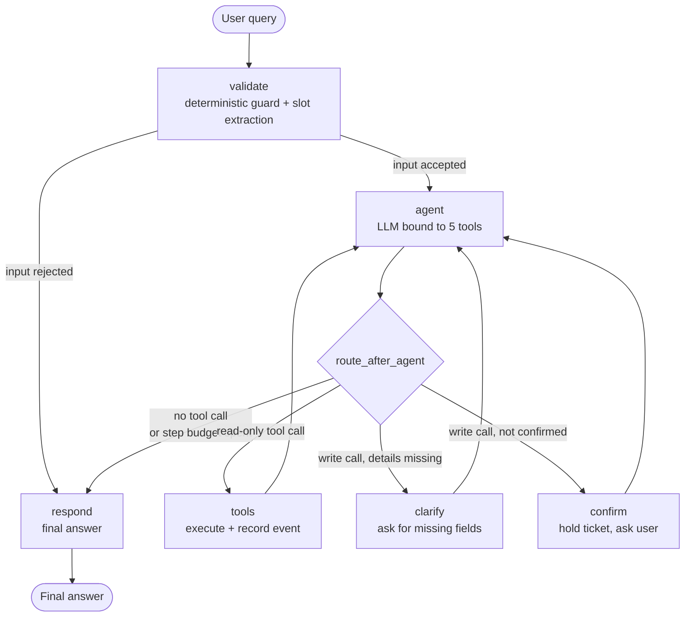

# Architecture

## Workflow graph



## Node responsibilities

| Node | Calls the LLM? | Responsibility |
| --- | --- | --- |
| `validate` | No | Rejects empty or oversized input, extracts `EMP####`, interprets a confirmation or a refusal of a pending ticket. |
| `agent` | Yes | Decides whether a tool is needed and with which arguments. Wraps model failures into a user-facing message. |
| `tools` | No | Executes every tool call, records a `tool_event`, promotes an employee lookup into remembered state. |
| `confirm` | No | Human-in-the-loop gate. Answers a `create_ticket` call with an instruction instead of executing it, and stores the draft. |
| `clarify` | No | Answers a `create_ticket` call that is missing required fields, naming exactly what is missing. |
| `respond` | No | Single exit point. Guarantees a non-empty answer. |

## State channels

| Channel | Reducer | Purpose |
| --- | --- | --- |
| `messages` | `add_messages` | Conversation transcript. |
| `employee_id`, `employee_profile` | last value | Identity, remembered across turns. |
| `pending_ticket` | last value | Draft ticket awaiting confirmation. |
| `confirmed` | last value | True only for the turn in which the user agreed. |
| `missing_fields` | last value | What a ticket still needs. |
| `tool_events` | `operator.add` | Append-only audit trail rendered by the UI. |
| `steps` | last value | Tool-loop budget for the current turn. |

State is persisted per conversation thread by a `SqliteSaver` checkpointer
(`data/checkpoints.db`), so a thread survives a page refresh.

## Data flow

```
Streamlit  --thread_id-->  LangGraph  --tool call-->  Tool  --SQL-->  SQLite
    ^                          |                        |
    |                          v                        v
    +----- answer + tool_events (rendered as an audit trail) -------+
```

## Safety controls

1. **Write gate** — `create_ticket` is the only write tool. It never runs on the
   turn the model first requests it; the graph routes to `confirm` instead.
2. **Field validation** — required fields, employee existence, and the allowed
   category and priority vocabularies are all checked before the insert.
3. **Duplicate suppression** — an open ticket from the same employee in the same
   category, or with a similar subject, within the configured window blocks the
   insert and returns the existing ticket.
4. **No fabrication** — tools return structured results; the system prompt
   forbids inventing tickets, employees or articles, and a knowledge search with
   no match returns an explicit "no article matched" note.
5. **Graceful failure** — every tool is wrapped so an exception becomes a failed
   result, and a model outage becomes a plain message rather than a stack trace.
6. **Loop budget** — `MAX_AGENT_STEPS` caps tool calls per turn.
